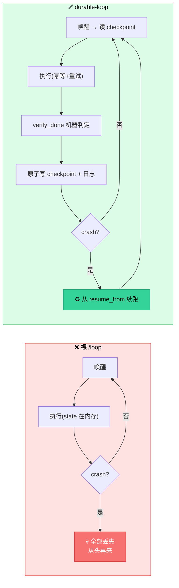
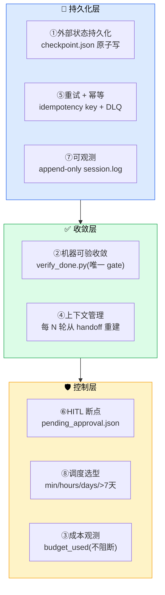
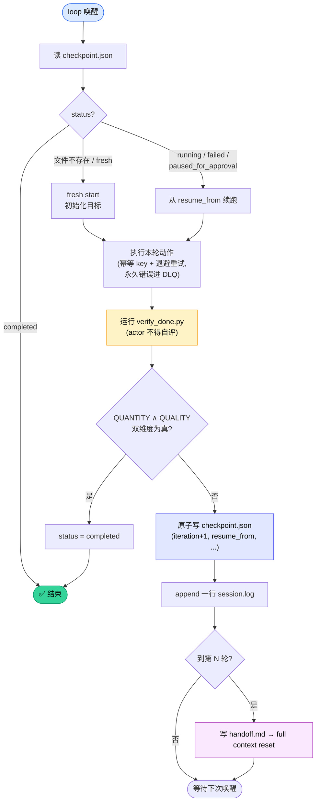
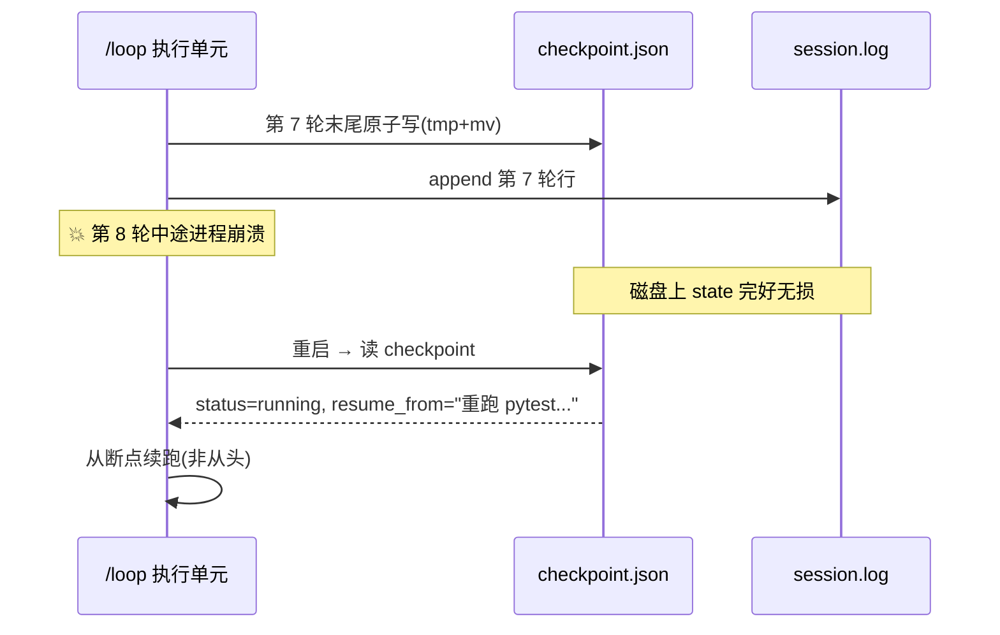
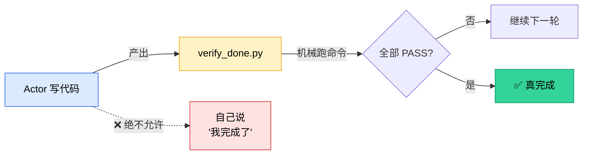
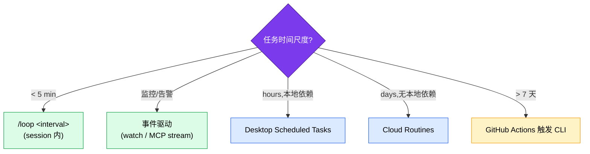

<div align="center">

<h1>durable-loop</h1>

<p><b>让 Claude Code 的长程自动循环跨崩溃存活、可机器验收收敛</b></p>

<p>
  
  
  
  
  
</p>

</div>

## 简介

Claude Code 内置的 `/loop` 只是一层 **时间触发器**——它解决"什么时候唤醒",但不解决"崩溃后怎么恢复""跑到一半算不算完成"。裸用 `/loop` 跑长程任务,等于**一个有闹钟但不存盘的 `while` 循环:进程一死,几小时成果归零**。

**durable-loop** 在 `/loop` 之上补足缺失的三件套——**状态持久化 + 崩溃恢复 + 收敛校验**,把"会失忆的循环"变成"能跨崩溃续跑、能机器验收的循环"。



> 设计哲学(2026-06 起):**纯质量收敛**。预算/thrashing 护栏已按需移除,`verify_done` 是唯一的 done 判据;成本只观测不阻断。`verify_done` 现做**抗 flip-flop 的 K-连续-PASS 收敛**(单次 PASS 不算完成)。所有刹车类增强(strict 危险操作拦截 / no-progress 暂停)**默认关闭、需显式 opt-in**——理念不变。

> **经验沉淀层 learnings(#3,2026-06-22 已实现)**:`.scratch/<feature>/learnings.jsonl` 跨轮/跨 run 累积"可复用经验",每轮构成 **reflect 闭环**——开头 `search` 借鉴历史(pattern 复用 / pitfall 规避),收尾 `log` 沉淀。`durable_loop_learn.py` 提供 `log/search/prune/compile` 四子命令;**(type,key) 去重合并**(confidence 取 max、seen+1、id 保留)比单纯追加更进一步,反复验证同一规律自然加深其 confidence。**默认开启、纯关键词检索零依赖、跨 feature 默认关、全程 fail-open**(是质量增强,不是刹车,不阻断任何调用)。context reset 时由 Stop hook 把"已验证经验"段直接注入新的 handoff。

---

## 为什么裸 /loop 长跑会出事

| 内置 `/loop` 给了什么 | 长跑还缺什么 |
|---|---|
| ⏰ 调度(Dynamic / Cron) | 💾 **状态持久化**——checkpoint 每轮落盘 |
| | ♻️ **恢复**——读 checkpoint 判断 resume vs fresh |
| | ✅ **收敛校验**——机器判定真完成,不靠模型自评 |
| | 🔁 **重试+幂等**——副作用不重复执行 |
| | 👁️ **可观测**——append-only 日志可复盘 |

两个被实证反复验证的失效模式,是这个 skill 存在的理由:

- **模型自评 done 偏乐观**:让模型自己判断"完成没",约 **30% 完成度**时就会声称 done(Huang 判据:纯内在 self-correction 系统性降低准确率)。
- **长 session 退化**:不做 context reset,约 **90 分钟**后退化成 tunnel vision(Ralph Loop 实测),遗忘早期目标与已否决方案。

---

## 核心架构:8 要素

durable-loop 把长跑可靠性拆成 8 个要素,每个都有明确的脚本/模板落地点。



| # | 要素 | 解决的 gap | 落地点 |
|---|---|---|---|
| ① | 外部状态持久化 | crash 即失忆 | `checkpoint.json` + Stop hook 原子写 |
| ② | 机器可验收敛 | 模型 30% 自评 done | `done.criteria.md` + `verify_done.py`(抗 flip-flop K-连续-PASS) |
| ③ | 成本观测 | 看不清花了多少 | `budget_used`(纯观测) |
| ④ | 上下文管理 | 90min tunnel vision | `handoff.md` + 每 N 轮 full reset(**Stop hook 自动刷新/归档/置 reset_due**) |
| ⑤ | 重试 + 幂等 | 95% 单步→端到端 60% | 退避 1/2/4/8s + `dead_letter/` DLQ +(可选)`durable_loop_guard.py` 幂等门 |
| ⑥ | HITL 断点 | 不可逆操作无刹车 | `pending_approval.json` + git-guardrails +(可选 opt-in)`durable_loop_guard.py` strict 拦截 |
| ⑦ | 可观测 | silent failure | `session.log`(PostToolUse hook,含 run_id)+ `replay_trace.py` 复盘 |
| ⑧ | 调度选型 | 场景错配丢 session/烧钱 | 时间尺度决策表 |

---

## 每轮生命周期

每次 `/loop` 唤醒执行单元,严格走这条流水线:



### 崩溃恢复:checkpoint 是唯一事实来源



> **关键**:`status` 必须用 `paused_for_approval` 而非 `paused`——恢复门只认前者,写错会被当成 fresh start 丢掉全部 state。原子写(`tmp` + `mv`)保证写一半崩溃也不损坏。

---

## 收敛:为什么不让模型自评

generator 与 evaluator **强制分离**——这是防"假装完成"的核心机制。



`done.criteria.md` 必须是 **QUANTITY + QUALITY 双维度同时为真**,避免单一条件被 `assert True` 式 gaming:

```markdown
QUANTITY(机械验证):
- [ ] 测试全绿:       pytest -x --tb=short
- [ ] 覆盖率达标:     pytest --cov=src --cov-fail-under=80
- [ ] 类型检查 clean: mypy src/

QUALITY(独立 evaluator 判定):
- [ ] 每个测试类测不同 module(防 assert True gaming)
- [ ] 无 dead code / 无 debug 残留
```

---

## 调度选型

按**时间尺度**选调度机制,错选会丢 session 或烧钱:



> ⚠️ **z.ai / GLM 等第三方 provider**:prompt cache TTL 固定 5min。调度间隔务必 `<5min` 且用 **240s 不用 300s**——300s 落在 cache 边界上,每轮 cache miss 成本翻倍。

---

## 快速开始

### 1. 初始化状态目录

```bash
# 跨平台首选(纯 stdlib Python)
python scripts/init_loop.py <feature> [project_dir]

# 或 Unix
bash scripts/init_loop.sh <feature>
```

生成 `.scratch/<feature>/` 完整骨架(checkpoint.json / done.criteria.md / handoff.md / session.log / dead_letter/ ...),脚本幂等。

### 2. 设计收敛条件

改写 `.scratch/<feature>/done.criteria.md`,填入你的 QUANTITY + QUALITY 命令与阈值。

### 3. 用 driver prompt 驱动

把 `assets/loop-driver-prompt.md` 的占位符(`<FEATURE>` `<TASK_DESCRIPTION>` `<MAX_ITERATIONS>` `<RESET_EVERY_N>` 等)替换后,整段喂给:

```bash
/loop 240s "<替换后的 prompt>"
```

### 4.(强烈推荐)装 2 个自动化 hook

把最易失约的软约束升级成 hook 强制,两者都 **非阻断 + fail-open**(无 active loop 时静默 no-op,全局安装安全):

| hook | 事件 | 强制 |
|---|---|---|
| `durable_loop_observe.py` | PostToolUse | 每个工具调用自动 append `session.log`(含 run_id) |
| `durable_loop_checkpoint.py` | Stop | 读 transcript 写 `budget_used` + 检测副作用更新 idempotency key + **每 `reset_every_n` 轮自动刷新 handoff/归档/置 `reset_due`** |

> **可选第 3 个 hook(默认 opt-in)**:`durable_loop_guard.py`(PreToolUse)——幂等门(副作用 key 命中即 deny)+ opt-in strict 危险操作拦截(env `DURABLE_LOOP_STRICT` 或 checkpoint.`strict_guard=true`)。不接线则零拦截,纯质量收敛理念不变。另有可选 `check_progress.py`(Stop)做 no-progress 暂停,默认关闭。

```jsonc
// Windows: C:/Users/<YOU>/.claude/settings.json (用绝对正斜杠 + python,不要 python3/$HOME)
"PostToolUse": [{ "hooks": [{ "type": "command",
  "command": "python \"C:/Users/<YOU>/.claude/skills/durable-loop/scripts/durable_loop_observe.py\"" }]}],
"Stop":        [{ "hooks": [{ "type": "command",
  "command": "python \"C:/Users/<YOU>/.claude/skills/durable-loop/scripts/durable_loop_checkpoint.py\"" }]}]
```

```jsonc
// macOS / Linux
"PostToolUse": [{ "hooks": [{ "type": "command",
  "command": "python \"$HOME/.claude/skills/durable-loop/scripts/durable_loop_observe.py\"" }]}],
"Stop":        [{ "hooks": [{ "type": "command",
  "command": "python \"$HOME/.claude/skills/durable-loop/scripts/durable_loop_checkpoint.py\"" }]}]
```

> 优先用内置 `/update-config` skill 合并;手工编辑请 **append** 不要覆盖现有数组。

---

## 三种配方

| 配方 | 场景 | 调度 | 收敛 |
|---|---|---|---|
| **A 长程研究 / 迭代优化** | 重构、调研、文档体系 | Dynamic self-paced(fallback 240s) | 双维度收敛 |
| **B 持续监控 + 告警** | PR review、CI 轮询、健康检查 | 优先事件驱动 | 不收敛,直到目标事件 |
| **C 自改进迭代** | prompt 优化、skill 库积累 | Dynamic + Cron 备份 | eval 分数连续 N 轮无提升 |

详见 [`references/recipes.md`](references/recipes.md)。

---

## 反模式 TOP 5

1. **裸 `while` + 内存 state** → crash 即失忆 ⟶ checkpoint 外部持久化
2. **done 靠模型自评** → 30% 就声明完成 ⟶ `verify_done.py` + 独立 evaluator
3. **单一收敛条件**(只看"测试通过") → 被 `assert True` gaming ⟶ QUANTITY+QUALITY 双维度
4. **持续 session 不 reset** → 90min tunnel vision ⟶ 每 N 轮 full reset + handoff
5. **无幂等 key** → 重复扣款 / 发邮件 ⟶ idempotency key + checkpoint 查重

完整 20 条见 [`references/methodology.md`](references/methodology.md)。

---

## 目录结构

```text
durable-loop/
├── SKILL.md                       # skill 入口(触发条件 + 工作流)
├── README.md                      # 本文件
├── assets/                        # 模板
│   ├── checkpoint.json            # 空状态模板
│   ├── checkpoint.example.json    # 填好的示例
│   ├── checkpoint.schema.md       # 字段语义(末节登记 learnings.jsonl schema)
│   ├── done.criteria.md           # 收敛条件模板
│   ├── handoff.md                 # context reset 交接模板
│   └── loop-driver-prompt.md      # 喂给 /loop 的驱动 prompt
├── references/                    # 方法论深解(按需加载)
│   ├── methodology.md             # 9 gap / 8 要素 / 20 反模式
│   └── recipes.md                 # 三配方详解
├── scripts/                       # 执行器(纯 stdlib,跨平台)
│   ├── init_loop.py / .sh         # 初始化状态目录(fresh 注入 run_id)
│   ├── verify_done.py / .sh       # 机械验收(唯一 gate;抗 flip-flop K-连续-PASS)
│   ├── replay_trace.py            # 只读 trace 复盘(session.log 按 run_id/iter 分组)
│   ├── emit_schedule.py           # 调度脚手架(min/hours/days/long 配置骨架)
│   ├── durable_loop_learn.py      # 经验沉淀层:log/search/prune/compile(reflect 闭环,#3)
│   ├── durable_loop_observe.py    # PostToolUse hook:写 session.log(含 run_id)
│   ├── durable_loop_checkpoint.py # Stop hook:写 budget/幂等/hours + 每 N 轮自动 handoff/reset(+注入已验证经验)
│   ├── durable_loop_guard.py      # (可选)PreToolUse 守卫:幂等门 + opt-in strict 拦截
│   ├── check_progress.py          # (可选)no-progress 暂停(默认关闭)
│   └── check_budget.py            # (保留作参考,默认不挂 hook)
└── tests/                         # pytest 套件
```

---

## Windows / WSL 注意

1. **home 目录分叉**:在 **WSL bash.exe** 里改 `~/.claude` 会落到 WSL 的目录,Windows 版 Claude Code **不读**;请改 `C:/Users/<YOU>/.claude`。**Git Bash 不受影响**。
2. **脚本调用**:优先 Python 入口(`python scripts/init_loop.py`),跨平台、不依赖 GNU `timeout`/bash 数组。
3. **hook 命令**:Windows 用绝对正斜杠路径 + `python`,**不要** `python3`/`$HOME`/`~`(PowerShell/cmd 下不解析)。
4. **feature 名**:只允许字母数字、`-`、`_`。

---

## 测试

```bash
pytest -q
```

覆盖 checkpoint replay、verify_done 命令解析、init 幂等、副作用检测等。脚本均为纯标准库,无第三方依赖。

---

## License

见 [SKILL.md](SKILL.md) 顶部说明。本 skill 复用 `git-guardrails-claude-code` / `strategic-compact` / `verification-loop` 等既有 skill,不重写其能力。
